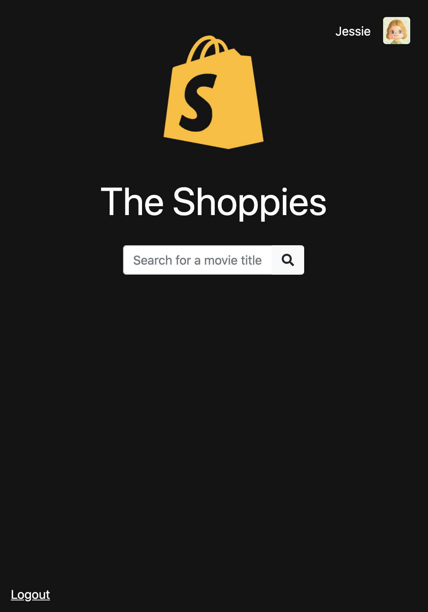
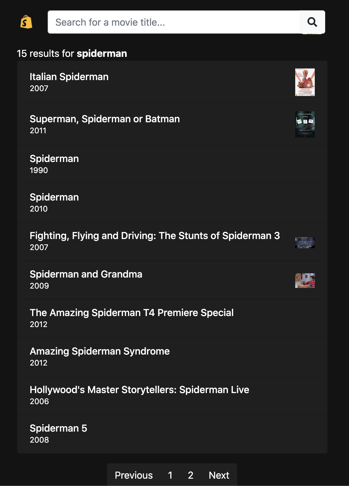
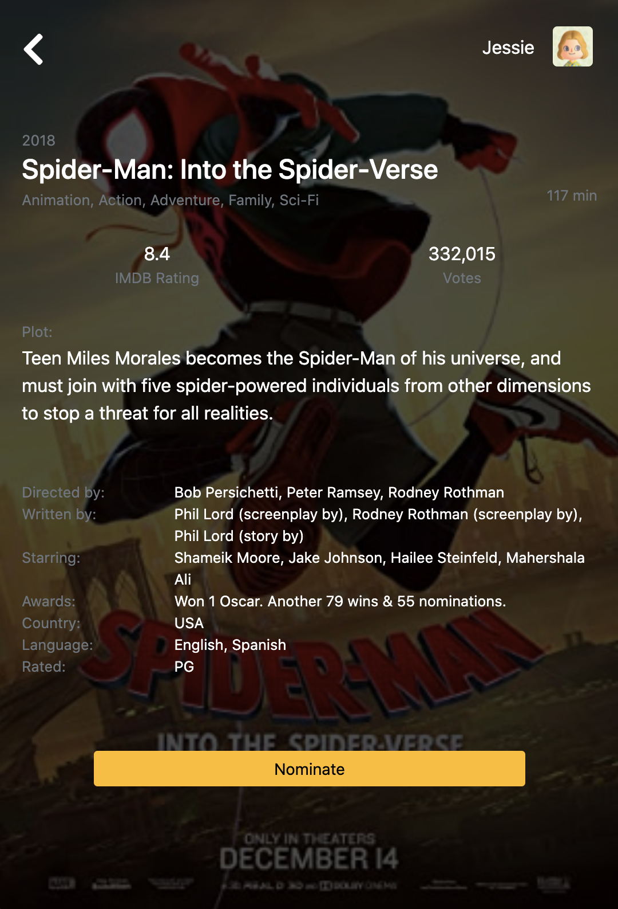
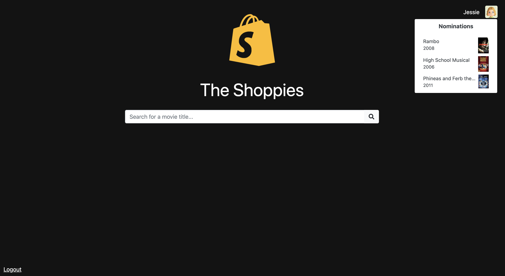
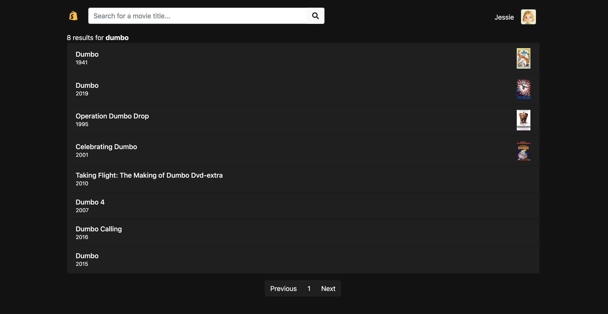
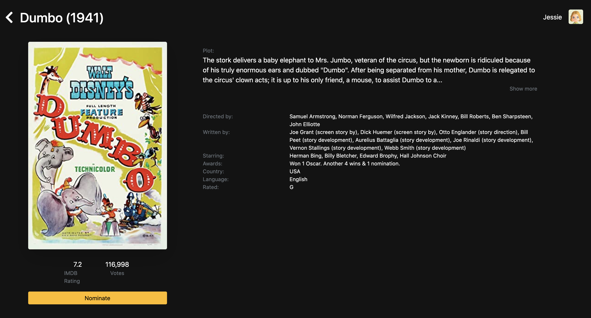
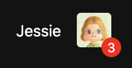

## The Shoppies 
[Demo](https://the-shoppies-award.herokuapp.com/welcome)

An application in which users can search and nominate 5 movies, powered by OMDB API and built with React, Redux, and Bootstrap.

## Project Screen Shot(s)

#### Mobile View

  
  
  

#### Desktop View

  
  
  

## Installation and Setup Instructions

To clone this repository you will need `node` and `npm` installed globally on your machine.  

The app is fetching from a hosted API, however you can change this to run on your localhost by cloning the [API](https://github.com/JessieW0010/shoppies-api) and replacing the API base URL in `/src/api`.

Installation:

`npm install`   

To Start Dev Server:

`npm run dev`  

To Visit App:

`localhost:3000`  

## Post application additional features

A pull request has been made for features I'll be adding after the application is reviewed. You can see these additions in the screenshots below!

| Description             |  Screenshot |
:-------------------------:|:-------------------------:
Added number of nomination display to avatar component  |  

## Reflection

This was a 4-day project built for Shopify's 2021 Winter Web Development Internship application. The applicaton must allow users to search movies via the hosted [API](https://frozen-dusk-95287.herokuapp.com) (powered by [OMDB API](http://www.omdbapi.com)) and add/ remove 5 movies from their list.

I started this process by using the `create-react-app` boilerplate, then adding `typescript`, `react-router`, `redux`, and `redux-saga`.

One of the main challenges I had were project time constraints, originally I had no plans of incorporating third party libraries for building components and styling but these plans were quickly tossed out on day 2. In the end, I chose to add `bootstrap-4` for easier styling, `font-awesome` for icons, `react-toastify` for displaying success and error messages, and `react-responsive` to change display for mobile/ desktop. 
